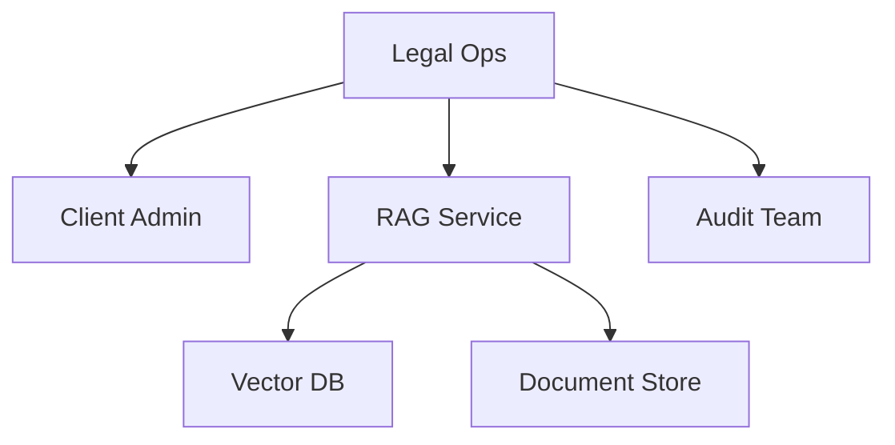
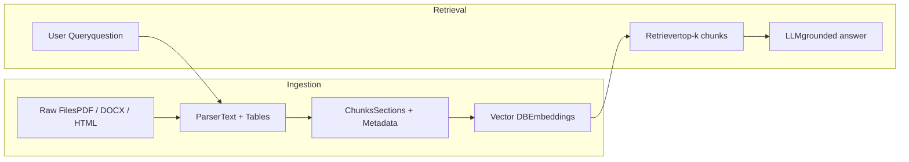
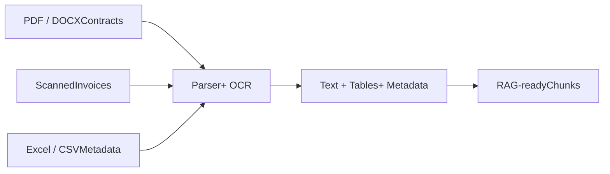
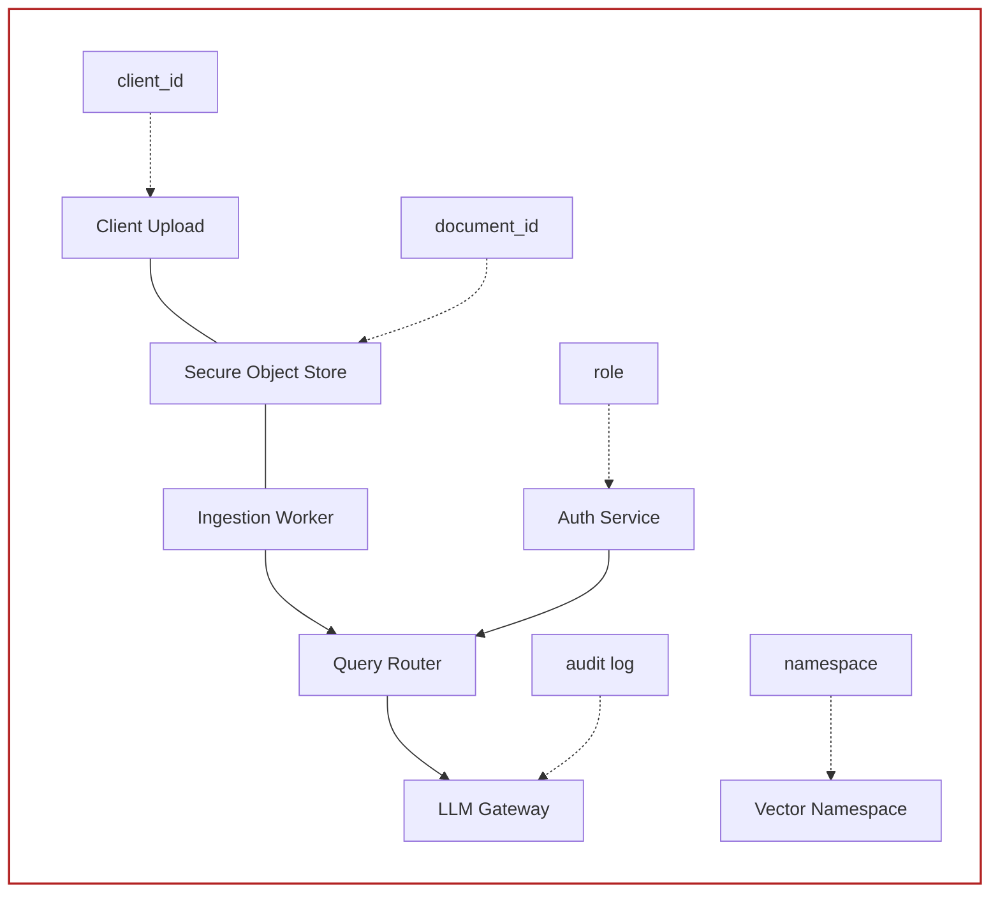

# Complex Document for RAG Parsing Tests

Synthetic 15-page PDF with paragraphs, simple and complex tables, diagrams, scanned-form style image, metadata examples, and production RAG edge cases.

## Story Line

Three client teams - Arka Finance, BlueLeaf Retail, and CityRide Mobility - are migrating contracts, policies, support records, and operational reports into a single RAG platform. Each team has different document types, access rules, and parsing challenges. The RAG system must answer questions with citations while ensuring that one client never sees another clients data.

This PDF is intentionally designed to test document loaders, PDF parsers, OCR workflows, table extraction, chunking strategies, metadata preservation, and source citation quality.

<mark>**Key statement: RAG does not train the model. RAG gives the model the right context before answering.**</mark>

<table>
  <thead>
    <tr>
        <th>Section</th>
        <th>Parsing challenge</th>
        <th>Why it matters for RAG</th>
    </tr>
  </thead>
  <tbody>
    <tr>
        <td>Contracts</td>
<td>Dense legal text, clause numbers, cross references</td>
<td>Need section-aware chunks and citations</td>
    </tr>
<tr>
        <td>Tables</td>
<td>Merged headers, numeric columns, footnotes</td>
<td>Need row/column preservation</td>
    </tr>
<tr>
        <td>Images</td>
<td>Architecture diagram, heatmap, scanned form</td>
<td>Need OCR or multimodal extraction</td>
    </tr>
<tr>
        <td>Multi-tenant metadata</td>
<td>client_id, document_id, contract_group_id</td>
<td>Need access-safe retrieval</td>
    </tr>
  </tbody>
</table>

Complex RAG Parsing Sample - synthetic document

Page 1


---

# 1. Business Scenario

The platform team is building a document intelligence layer for contract operations. Legal users need answers such as: Which contracts renew automatically? Which agreements have a 60-day termination notice? Which documents mention data residency in India? These questions require retrieval across multiple document types and sometimes across multiple related documents of a single client.

Support teams also want answers from SOPs, markdown runbooks, HTML exports, chat transcripts, and CSV logs. A single parser is not enough because the corpus contains born-digital PDFs, scanned forms, HTML, markdown, and spreadsheet-like tables.

<table>
  <thead>
    <tr>
        <th>Client</th>
        <th>Main document family</th>
        <th>Risk</th>
        <th>Primary users</th>
        <th>Typical question</th>
    </tr>
  </thead>
  <tbody>
    <tr>
        <td>Arka Finance</td>
<td>MSA, audit addendum, DPA</td>
<td>High</td>
<td>Legal and compliance</td>
<td>What audit rights exist in the DPA?</td>
    </tr>
<tr>
        <td>BlueLeaf Retail</td>
<td>MSA, pricing, support SLA</td>
<td>Medium</td>
<td>Procurement</td>
<td>Which clause controls renewal pricing?</td>
    </tr>
<tr>
        <td>CityRide Mobility</td>
<td>Ops reports, incident logs, SOPs</td>
<td>Medium</td>
<td>Operations</td>
<td>Which depot had repeated battery incidents?</td>
    </tr>
  </tbody>
</table>

## Contract Processing Ownership Map



Caption: Ownership map showing how client admins, legal teams, audit teams, document storage, vector storage, and the RAG service interact.

Complex RAG Parsing Sample - synthetic document

Page 2


---

# 2. Raw Data Inventory

The ingestion team receives files from multiple sources. Some files are clean and digital; others contain scanned pages, rotated tables, missing metadata, embedded images, or formula-generated values. The inventory below intentionally includes different formats and extraction expectations.

<table>
  <thead>
    <tr>
        <th>Asset ID</th>
        <th>Client</th>
        <th>Format</th>
        <th>Pages/Rows</th>
        <th>Expected extraction</th>
        <th>Notes</th>
    </tr>
  </thead>
  <tbody>
    <tr>
        <td>ARK-MSA-001</td>
<td>Arka Finance</td>
<td>PDF</td>
<td>32 pages</td>
<td>Clauses, tables, signatures</td>
<td>Born-digital text with footer references</td>
    </tr>
<tr>
        <td>ARK-DPA-002</td>
<td>Arka Finance</td>
<td>DOCX</td>
<td>18 pages</td>
<td>Headings, lists, tables</td>
<td>Track changes removed before ingestion</td>
    </tr>
<tr>
        <td>BLR-PRICE-003</td>
<td>BlueLeaf Retail</td>
<td>XLSX</td>
<td>12 sheets</td>
<td>Rate cards, discounts</td>
<td>Merged cells and formulas</td>
    </tr>
<tr>
        <td>BLR-SLA-004</td>
<td>BlueLeaf Retail</td>
<td>PDF</td>
<td>9 pages</td>
<td>SLA table, escalation matrix</td>
<td>Table crosses page boundary</td>
    </tr>
<tr>
        <td>CRM-OPS-005</td>
<td>CityRide Mobility</td>
<td>CSV</td>
<td>48,200 rows</td>
<td>Incident records</td>
<td>Needs column type normalization</td>
    </tr>
<tr>
        <td>CRM-FORM-006</td>
<td>CityRide Mobility</td>
<td>Scanned PDF</td>
<td>4 pages</td>
<td>OCR fields, checkbox</td>
<td>Low contrast and slight rotation</td>
    </tr>
<tr>
        <td>KB-RUN-007</td>
<td>Shared</td>
<td>Markdown</td>
<td>14 files</td>
<td>Runbook sections</td>
<td>Good for heading-based chunks</td>
    </tr>
<tr>
        <td>WEB-FAQ-008</td>
<td>Shared</td>
<td>HTML</td>
<td>23 pages</td>
<td>FAQ content, links</td>
<td>Needs boilerplate removal</td>
    </tr>
  </tbody>
</table>

<mark>**Parsing difficulty increases when a document combines multiple layouts: paragraph text, tables, images, and notes. Good parsers preserve structure; weak parsers flatten everything into a noisy text stream.**</mark>

Complex RAG Parsing Sample - synthetic document

Page 3


---

# 3. Contract Excerpt: Dense Legal Text

Clause 7.2 - Confidential Information. The Receiving Party shall protect Confidential Information using at least the same degree of care that it uses to protect its own confidential materials, but in no event less than reasonable care. Confidential Information includes technical documents, pricing schedules, user lists, API keys, operational procedures, security reports, incident response notes, product roadmaps, and any derived analysis prepared by the Receiving Party.

Clause 7.3 - Exclusions. Confidential Information does not include information that is publicly available without breach, independently developed without reference to the Disclosing Party material, received lawfully from a third party, or approved for release in writing. The burden of proving an exclusion remains with the Receiving Party.

Clause 9.1 - Data Residency. If the Statement of Work identifies a specific processing region, the service provider shall process production records only within that region unless the client approves a transfer in writing. Disaster recovery replicas may be stored in a secondary region if encryption at rest and access logging are enabled.

Clause 11.4 - Termination Assistance. Upon termination, the provider shall make client data available for export for a period of thirty days. After the export period, the provider may delete production data according to the deletion schedule unless a legal hold applies.

<table>
  <thead>
    <tr>
        <th>Clause</th>
        <th>Short name</th>
        <th>Owner</th>
        <th>Trigger</th>
        <th>Required action</th>
        <th>Citation hint</th>
    </tr>
  </thead>
  <tbody>
    <tr>
        <td>7.2</td>
<td>Confidentiality</td>
<td>Receiving Party</td>
<td>Receipt of confidential material</td>
<td>Protect information with reasonable care and equivalent internal controls</td>
<td>Page 4, clause 7.2</td>
    </tr>
<tr>
        <td>9.1</td>
<td>Data residency</td>
<td>Service Provider</td>
<td>SOW specifies region</td>
<td>Process production records only in approved region</td>
<td>Page 4, clause 9.1</td>
    </tr>
<tr>
        <td>11.4</td>
<td>Termination assistance</td>
<td>Service Provider</td>
<td>Agreement termination</td>
<td>Provide export window for 30 days</td>
<td>Page 4, clause 11.4</td>
    </tr>
  </tbody>
</table>

**Parser note: clause numbering is important. Chunking should not remove or split clause identifiers because users often ask questions using clause numbers.**

Complex RAG Parsing Sample - synthetic document

Page 4


---

# 4. Simple Table: Policy Rules

The following table is intentionally simple. It should be correctly extracted by most PDF table parsers. It tests basic row and column detection, short text values, and numeric values.

<table>
  <thead>
    <tr>
        <th>Policy Area</th>
        <th>Rule</th>
        <th>Owner</th>
        <th>Review Cycle</th>
    </tr>
  </thead>
  <tbody>
    <tr>
        <td>Refunds</td>
<td>Refund requests must be raised within 7 days of purchase.</td>
<td>Customer Support</td>
<td>Quarterly</td>
    </tr>
<tr>
        <td>Data Export</td>
<td>Client admins can request export in CSV or JSON format.</td>
<td>Platform Ops</td>
<td>Monthly</td>
    </tr>
<tr>
        <td>Access Review</td>
<td>Privileged access must be reviewed every 30 days.</td>
<td>Security</td>
<td>Monthly</td>
    </tr>
<tr>
        <td>Incident Response</td>
<td>Critical incidents require acknowledgement within 30 minutes.</td>
<td>SRE</td>
<td>After each incident</td>
    </tr>
<tr>
        <td>Vendor Review</td>
<td>High-risk vendors require annual risk assessment.</td>
<td>Procurement</td>
<td>Annual</td>
    </tr>
  </tbody>
</table>

## Narrative Around the Table

This table appears between paragraphs, which is common in enterprise documents. A good parser should preserve the paragraph before the table, the table content, and the paragraph after the table in the correct reading order.

For RAG systems, simple tables are often converted into row-wise text chunks such as: Policy Area: Refunds; Rule: Refund requests must be raised within 7 days; Owner: Customer Support.

Complex RAG Parsing Sample - synthetic document

Page 5
5


---

# 5. Complex Table: SLA, Escalation, and Credits

This table uses long cells and operational footnotes. It is designed to test whether the parser can retain header hierarchy and map values to the correct columns.

<table>
  <thead>
    <tr>
        <th>Service Category</th>
        <th>Severity</th>
        <th>Response Target</th>
        <th>Resolution Target</th>
        <th>Service Credit</th>
        <th>Evidence Required</th>
    </tr>
  </thead>
  <tbody>
    <tr>
        <td>API Availability</td>
<td>P1 - complete<br/>outage</td>
<td>15 minutes</td>
<td>4 hours</td>
<td>10 percent monthly<br/>fee credit</td>
<td>Monitoring logs and incident<br/>ticket</td>
    </tr>
<tr>
        <td>API Availability</td>
<td>P2 - degraded<br/>performance</td>
<td>30 minutes</td>
<td>8 hours</td>
<td>5 percent monthly fee<br/>credit</td>
<td>Latency dashboard and<br/>affected endpoint list</td>
    </tr>
<tr>
        <td>Data Pipeline</td>
<td>P1 - ingestion<br/>stopped</td>
<td>20 minutes</td>
<td>6 hours</td>
<td>8 percent pipeline fee<br/>credit</td>
<td>Queue depth, failed job IDs,<br/>replay report</td>
    </tr>
<tr>
        <td>Data Pipeline</td>
<td>P3 - delayed<br/>batch</td>
<td>4 hours</td>
<td>Next business day</td>
<td>No automatic credit</td>
<td>Batch ID and SLA exception<br/>note</td>
    </tr>
<tr>
        <td>Support</td>
<td>P2 - urgent<br/>support</td>
<td>1 hour</td>
<td>1 business day</td>
<td>2 percent support fee<br/>credit</td>
<td>Support ticket with timestamps</td>
    </tr>
  </tbody>
</table>

Footnote A: Service credits are not cumulative across the same service category for the same calendar month. Footnote B: Credits do not apply when delay is caused by client-side network restrictions, missing credentials, or force majeure events.

> Parser note: table footnotes should remain attached to the table. If the footnote is separated, an answer about credits may become incomplete or misleading.

Complex RAG Parsing Sample - synthetic document Page 6


---

# 6. Image: RAG Architecture Diagram

The diagram below represents the ingestion and retrieval flow. Some PDF parsers ignore images completely, while others extract image metadata but not the text inside the image. For production use, image content may require OCR or multimodal extraction.

## RAG Ingestion and Retrieval Flow



Parsing challenge: each stage can improve or damage answer quality.

Caption: A simplified RAG pipeline showing raw files, parsing, chunking, embeddings, vector database, retriever, LLM, and grounded answer generation.

<table>
  <thead>
    <tr>
        <th>Image element</th>
        <th>Potential extraction method</th>
        <th>Expected output</th>
    </tr>
  </thead>
  <tbody>
    <tr>
        <td>Box labels</td>
<td>OCR or vision model</td>
<td>Raw Files, Parser, Chunks, Vector DB</td>
    </tr>
<tr>
        <td>Arrows</td>
<td>Layout or vision understanding</td>
<td>Processing order</td>
    </tr>
<tr>
        <td>Caption</td>
<td>Normal PDF text extraction</td>
<td>Description of the diagram</td>
    </tr>
  </tbody>
</table>

Complex RAG Parsing Sample - synthetic document Page 7


---

# 7. Markdown Runbook Excerpt

Markdown files are often easier to parse because headings and code blocks are explicit. However, when markdown is exported to PDF, the structure may become visual rather than semantic.

```markdown
# Runbook: Contract Ingestion Failure

## Symptoms
- Upload status remains `processing` for more than 30 minutes.
- Worker logs show repeated timeout errors.
- Vector count does not increase for the affected document.

## Recovery Steps
1. Confirm the object exists in document storage.
2. Re-run parser with `safe_mode=True`.
3. Rebuild chunks with the previous chunking configuration.
4. Compare chunk count with the last successful ingestion.
5. Trigger re-embedding only for changed chunks.
```

A good parser should preserve code block boundaries and avoid mixing numbered steps with surrounding prose. In RAG, runbooks are useful because users often ask operational questions that require exact steps.

<table>
  <thead>
    <tr>
        <th>Runbook field</th>
        <th>Value</th>
        <th>Parsing expectation</th>
    </tr>
  </thead>
  <tbody>
    <tr>
        <td>Title</td>
<td>Contract Ingestion Failure</td>
<td>Should become section title metadata</td>
    </tr>
<tr>
        <td>Symptoms</td>
<td>Five bullet items</td>
<td>Should remain as list or separate lines</td>
    </tr>
<tr>
        <td>Recovery Steps</td>
<td>Numbered sequence</td>
<td>Order must be preserved</td>
    </tr>
  </tbody>
</table>

Complex RAG Parsing Sample - synthetic document

Page 8


---

# 8. Scanned Form and OCR Challenge

This page contains a scanned-form style image. Text inside the form is not normal selectable PDF text. A simple text parser may miss it entirely. OCR-based systems should extract labels, values, and checkboxes from the image.

### CONTRACT INTAKE FORM

* **Client Name**: BlueLeaf Retail Pvt Ltd
* **Contract ID**: BLR-MSA-2026-019
* **Effective Date**: 01 Apr 2026
* **Renewal Type**: Auto renewal with 60 day notice
* **Data Region**: India - South
* **Reviewer**: K. Mehta
* [x] Approved for ingestion after PII masking

Caption: The form includes fields such as Client Name, Contract ID, Effective Date, Renewal Type, Data Region, Reviewer, and a checkbox approval statement.

<table>
  <thead>
    <tr>
        <th>Field</th>
        <th>Expected OCR value</th>
        <th>Validation rule</th>
    </tr>
  </thead>
  <tbody>
    <tr>
        <td>Client Name</td>
<td>BlueLeaf Retail Pvt Ltd</td>
<td>Must match known client list</td>
    </tr>
<tr>
        <td>Contract ID</td>
<td>BLR-MSA-2026-019</td>
<td>Pattern: client-code + type + year + sequence</td>
    </tr>
<tr>
        <td>Effective Date</td>
<td>01 Apr 2026</td>
<td>Date parser should normalize to ISO format</td>
    </tr>
<tr>
        <td>Approval checkbox</td>
<td>Checked</td>
<td>Boolean extraction required</td>
    </tr>
  </tbody>
</table>

Complex RAG Parsing Sample - synthetic document

Page 9


---

# 9. Multiple Documents for One Client

BlueLeaf Retail has five related contract documents. If these documents are indexed independently without relationship metadata, the retriever may miss cross-document context. The platform uses a `contract_group_id` to connect related documents.

<table>
  <thead>
    <tr>
        <th>document_id</th>
        <th>document_type</th>
        <th>contract_group_id</th>
        <th>effective_date</th>
        <th>relationship</th>
    </tr>
  </thead>
  <tbody>
    <tr>
        <td>BLR-MSA-001</td>
<td>Master Service Agreement</td>
<td>BLR-ACME-2026</td>
<td>2026-04-01</td>
<td>Base commercial agreement</td>
    </tr>
<tr>
        <td>BLR-NDA-002</td>
<td>NDA</td>
<td>BLR-ACME-2026</td>
<td>2026-04-01</td>
<td>Confidentiality terms</td>
    </tr>
<tr>
        <td>BLR-SOW-003</td>
<td>Statement of Work</td>
<td>BLR-ACME-2026</td>
<td>2026-04-15</td>
<td>Project scope and deliverables</td>
    </tr>
<tr>
        <td>BLR-PRICE-004</td>
<td>Pricing Amendment</td>
<td>BLR-ACME-2026</td>
<td>2026-05-01</td>
<td>Updated pricing and discount tiers</td>
    </tr>
<tr>
        <td>BLR-SLA-005</td>
<td>Support SLA</td>
<td>BLR-ACME-2026</td>
<td>2026-05-10</td>
<td>Support response and credits</td>
    </tr>
  </tbody>
</table>

Example question: What does the BlueLeaf agreement say about termination assistance and pricing changes? A good retriever may need chunks from the MSA and the Pricing Amendment together.

<mark>Relationship metadata allows retrieval across related documents without mixing unrelated client data.</mark>

Complex RAG Parsing Sample - synthetic document

Page 10


---

# 10. Multi-tenant Retrieval and Access Control

In a multi-tenant RAG system, each document, chunk, embedding, and retrieval request should be associated with a tenant identifier. Client isolation should happen before the LLM receives any context.

<table>
  <thead>
    <tr>
        <th>Layer</th>
        <th>Control</th>
        <th>Failure mode if missing</th>
    </tr>
  </thead>
  <tbody>
    <tr>
        <td>Authentication</td>
<td>Identify user and organization</td>
<td>Unknown user may access application</td>
    </tr>
<tr>
        <td>Authorization</td>
<td>Map user to client_id and role</td>
<td>User may retrieve another clients documents</td>
    </tr>
<tr>
        <td>Vector retrieval</td>
<td>Filter by client_id or namespace</td>
<td>Retriever may return unauthorized chunks</td>
    </tr>
<tr>
        <td>Prompt construction</td>
<td>Send only allowed context</td>
<td>LLM may see sensitive data</td>
    </tr>
<tr>
        <td>Audit logging</td>
<td>Record query, source chunks, user_id</td>
<td>No traceability during incident review</td>
    </tr>
  </tbody>
</table>

<mark>**Correct flow: authenticate user, get client_id from backend, retrieve only matching chunks, build prompt with authorized context, return answer with citations.**</mark>

Wrong flow: retrieve from all clients and tell the model to ignore unauthorized content. This is unsafe because the LLM should not be used as the access-control boundary.

Complex RAG Parsing Sample - synthetic document

Page 11
11


---

# 11. Analytics Image: Retention Heatmap

The heatmap below simulates viewership retention by time slot. A parser that ignores chart images will miss useful business context. OCR can extract axis labels and numbers, but chart understanding may require a vision model.

Viewer Retention Heatmap by Time Slot

<table>
  <thead>
    <tr>
        <th>Time Slot</th>
        <th>Mon</th>
        <th>Tue</th>
        <th>Wed</th>
        <th>Thu</th>
        <th>Fri</th>
    </tr>
  </thead>
  <tbody>
    <tr>
        <td>Morning</td>
<td>72</td>
<td>48</td>
<td>31</td>
<td>18</td>
<td>10</td>
    </tr>
<tr>
        <td>Noon</td>
<td>65</td>
<td>54</td>
<td>39</td>
<td>20</td>
<td>15</td>
    </tr>
<tr>
        <td>Evening</td>
<td>40</td>
<td>62</td>
<td>77</td>
<td>58</td>
<td>21</td>
    </tr>
<tr>
        <td>Prime</td>
<td>28</td>
<td>43</td>
<td>69</td>
<td>88</td>
<td>60</td>
    </tr>
<tr>
        <td>Late</td>
<td>18</td>
<td>24</td>
<td>45</td>
<td>72</td>
<td>93</td>
    </tr>
  </tbody>
</table>

<table>
  <thead>
    <tr>
        <th>Observation</th>
        <th>Supporting value</th>
        <th>Scheduling implication</th>
    </tr>
  </thead>
  <tbody>
    <tr>
        <td>Prime Friday performs best</td>
<td>93 retention score</td>
<td>Place premium content in Friday late/prime slots</td>
    </tr>
<tr>
        <td>Early week late slots underperform</td>
<td>10 to 21 score range</td>
<td>Avoid launching new series in weak slots</td>
    </tr>
<tr>
        <td>Evening improves midweek</td>
<td>77 on Wednesday evening</td>
<td>Use midweek evening for discovery content</td>
    </tr>
  </tbody>
</table>

<mark>For RAG, chart captions should be indexed. If chart values are critical, extract them into structured metadata or a companion table.</mark>

Complex RAG Parsing Sample - synthetic document

Page 12


---

# 12. Evaluation Dataset

A RAG system should be evaluated separately for retrieval quality and answer quality. This page includes a miniature evaluation set with expected source references. It is useful for testing whether citations point to the correct section.

<table>
  <thead>
    <tr>
        <th>Test ID</th>
        <th>Question</th>
        <th>Expected source</th>
        <th>Expected answer element</th>
        <th>Failure signal</th>
    </tr>
  </thead>
  <tbody>
    <tr>
        <td>Q-001</td>
<td>What is the refund window?</td>
<td>Policy Rules table</td>
<td>7 days</td>
<td>Answer says 30 days</td>
    </tr>
<tr>
        <td>Q-002</td>
<td>Which clause covers data residency?</td>
<td>Clause 9.1</td>
<td>Approved processing region</td>
<td>No clause citation</td>
    </tr>
<tr>
        <td>Q-003</td>
<td>What is P1 API response target?</td>
<td>SLA table</td>
<td>15 minutes</td>
<td>Wrong severity row</td>
    </tr>
<tr>
        <td>Q-004</td>
<td>Which documents belong to BLR-ACME-2026?</td>
<td>Relationship table</td>
<td>Five related documents</td>
<td>Only one document returned</td>
    </tr>
<tr>
        <td>Q-005</td>
<td>Who owns access review?</td>
<td>Policy Rules table</td>
<td>Security</td>
<td>Owner missing</td>
    </tr>
  </tbody>
</table>

Evaluation should include adversarial questions, unrelated questions, and questions that require multi-hop retrieval across related documents.

Complex RAG Parsing Sample - synthetic document

Page 13


---

# 13. Edge Cases for Parsers

The following cases often break real document ingestion pipelines. They are included here as guidance for testing parser quality before moving to embeddings and vector storage.

<table>
  <thead>
    <tr>
        <th>Edge case</th>
        <th>Example</th>
        <th>Recommended handling</th>
    </tr>
  </thead>
  <tbody>
    <tr>
        <td>Repeated headers and footers</td>
<td>Page number, confidentiality banner</td>
<td>Remove or store separately as metadata</td>
    </tr>
<tr>
        <td>Hyphenated line breaks</td>
<td>termi- nation assistance</td>
<td>Normalize during cleaning</td>
    </tr>
<tr>
        <td>Rotated tables</td>
<td>Landscape appendix in PDF</td>
<td>Use layout-aware parser or OCR</td>
    </tr>
<tr>
        <td>Merged cells</td>
<td>Pricing table with grouped plans</td>
<td>Preserve hierarchy in row text</td>
    </tr>
<tr>
        <td>Scanned signatures</td>
<td>Signature block as image</td>
<td>OCR if text is needed; store image reference</td>
    </tr>
<tr>
        <td>Boilerplate navigation</td>
<td>Website header and footer</td>
<td>Use boilerplate removal</td>
    </tr>
<tr>
        <td>Duplicate chunks</td>
<td>Same policy in FAQ and PDF</td>
<td>Deduplicate using source and hash</td>
    </tr>
  </tbody>
</table>

**Bad parsing creates bad chunks. Bad chunks create bad retrieval. Bad retrieval creates bad answers.**

Complex RAG Parsing Sample - synthetic document Page 14


---

# 15. Final Ingestion Checklist

Use this checklist before sending parsed content into chunking and embeddings. It helps identify whether the data is ready for production RAG.

<table>
  <thead>
    <tr>
        <th>Checklist item</th>
        <th>Status to verify</th>
        <th>Why it matters</th>
    </tr>
  </thead>
  <tbody>
    <tr>
        <td>Text extraction</td>
<td>Paragraphs are readable and ordered</td>
<td>Prevents noisy chunks</td>
    </tr>
<tr>
        <td>Table extraction</td>
<td>Rows, columns, headers, and footnotes preserved</td>
<td>Protects factual answers</td>
    </tr>
<tr>
        <td>Image handling</td>
<td>Captions indexed and OCR done if required</td>
<td>Avoids missing visual information</td>
    </tr>
<tr>
        <td>Metadata</td>
<td>source, page, client_id, document_id captured</td>
<td>Enables citations and access control</td>
    </tr>
<tr>
        <td>Chunking</td>
<td>Chunks preserve meaning and section boundaries</td>
<td>Improves retrieval relevance</td>
    </tr>
<tr>
        <td>Access control</td>
<td>Retrieval filters use authenticated client_id</td>
<td>Prevents data leakage</td>
    </tr>
<tr>
        <td>Evaluation</td>
<td>Golden questions tested with citations</td>
<td>Measures real answer quality</td>
    </tr>
  </tbody>
</table>

Summary: RAG is about knowledge access. Fine-tuning is about behavior adaptation. For document intelligence, parsing quality is the foundation. If extraction is weak, no embedding model or LLM can fully fix the missing context.

End of synthetic 15-page parsing test document.

Complex RAG Parsing Sample - synthetic document

Page 15


---

# Appendix A: Complex Clause Responsibility Matrix

Grouped clauses with owner/backup split inside the same responsibility cell. This page is useful for testing row grouping, merged-looking labels, split responsibility cells, and long evidence text.

**Parsing challenge**: preserve row boundaries, nested headers, split cells, grouped labels, numeric values, and footnotes/context around the table.

and a split responsibility cell where owner and backup are shown inside the same row.

<table>
  <thead>
    <tr>
        <th>Clause Group</th>
        <th>Obligation</th>
        <th>Responsible Team</th>
        <th>Trigger</th>
        <th>Evidence Required</th>
        <th>Risk</th>
    </tr>
  </thead>
  <tbody>
    <tr>
        <td rowspan="2">Data Protection</td>
<td>Delete client data after contract termination unless retention is legally required.</td>
<td><strong>Owner</strong> Compliance<br/><strong>Backup</strong> Legal</td>
<td>Termination notice received</td>
<td>Deletion certificate + audit log export</td>
<td>High</td>
    </tr>
<tr>
        <td>Notify client about any confirmed data incident within 72 hours.</td>
<td><strong>Owner</strong> Security<br/><strong>Backup</strong> DPO</td>
<td>Incident classified as confirmed breach</td>
<td>Incident report, timeline, notification proof</td>
<td>Critical</td>
    </tr>
<tr>
        <td rowspan="2">Billing</td>
<td>Apply annual platform fee adjustment only after renewal confirmation.</td>
<td><strong>Owner</strong> Finance<br/><strong>Backup</strong> CSM</td>
<td>Renewal order approved</td>
<td>Approved renewal sheet + invoice draft</td>
<td>Medium</td>
    </tr>
<tr>
        <td>Do not bill inactive campuses during suspension period.</td>
<td><strong>Owner</strong> Revenue Ops<br/><strong>Backup</strong> Finance</td>
<td>Campus status = suspended</td>
<td>ERP campus status export</td>
<td>High</td>
    </tr>
<tr>
        <td rowspan="2">Support</td>
<td>Provide P1 response within 30 minutes during school operating hours.</td>
<td><strong>Owner</strong> Support L2<br/><strong>Backup</strong> Ops Manager</td>
<td>Ticket priority = P1</td>
<td>Ticket timestamps + agent assignment log</td>
<td>High</td>
    </tr>
<tr>
        <td>Escalate unresolved P2 tickets after 4 business hours.</td>
<td><strong>Owner</strong> Support L1<br/><strong>Backup</strong> Support L2</td>
<td>Ticket age &gt; 4 business hours</td>
<td>Escalation log</td>
<td>Medium</td>
    </tr>
  </tbody>
</table>

Table 1: Added as complex parsing appendix for table extraction, OCR fallback, and layout-aware RAG testing.

Complex RAG Parsing Sample - appended complex tables

Appendix page 1
1


---

# Appendix B: Regional Pricing and Usage Add-on Matrix

Pricing table with multi-level headers, regional columns, add-on columns, billing rules, exception rows, and mixed numeric/text values.

**Parsing challenge**: preserve row boundaries, nested headers, split cells, grouped labels, numeric values, and footnotes/context around the table.

<table>
  <thead>
    <tr>
        <th rowspan="2">Plan</th>
        <th rowspan="2">Student Volume</th>
        <th colspan="2">Annual Platform Charges</th>
        <th colspan="2">Usage Add-ons</th>
        <th rowspan="2">Billing Rule</th>
    </tr>
<tr>
        <th>India Region</th>
        <th>International</th>
        <th>SMS</th>
        <th>WhatsApp</th>
    </tr>
  </thead>
  <tbody>
    <tr>
        <td>Starter</td>
<td>0 - 2,000 students</td>
<td><strong>Base</strong> INR 4.5L<br/><strong>Support</strong> INR 60K</td>
<td>USD 7,200</td>
<td>INR 0.18/message</td>
<td>INR 0.42/message</td>
<td>Quarterly advance</td>
    </tr>
<tr>
        <td>Growth</td>
<td>2,001 - 10,000 students</td>
<td><strong>Base</strong> INR 11L<br/><strong>Support</strong> INR 1.4L</td>
<td>USD 18,000</td>
<td>INR 0.15/message</td>
<td>INR 0.38/message</td>
<td>50% advance + monthly usage</td>
    </tr>
<tr>
        <td>Enterprise</td>
<td>10,001+ students</td>
<td><strong>Base</strong> Custom<br/><strong>Support</strong> Included</td>
<td>Custom</td>
<td>Negotiated</td>
<td>Negotiated</td>
<td>Signed order form required</td>
    </tr>
<tr>
        <td>Exception</td>
<td>Government schools</td>
        <td colspan="2">Discount may apply after approval</td>
        <td colspan="2">No discount on pass-through cost</td>
<td>Requires CFO approval</td>
    </tr>
  </tbody>
</table>

Table 2: Added as complex parsing appendix for table extraction, OCR fallback, and layout-aware RAG testing.

Complex RAG Parsing Sample - appended complex tables

Appendix page 2


---

# Appendix C: Invoice Line Items with Tax Split

Invoice-style line item table with item groups, quantity, rate, CGST/SGST split, totals, and summary row. Useful for invoice parsing and tax extraction tests.

**Parsing challenge**: preserve row boundaries, nested headers, split cells, grouped labels, numeric values, and footnotes/context around the table.

<table>
  <thead>
    <tr>
        <th rowspan="2">Item Group</th>
        <th rowspan="2">Line Item</th>
        <th rowspan="2">Qty</th>
        <th rowspan="2">Rate</th>
        <th colspan="2">Tax Split</th>
        <th rowspan="2">Total</th>
    </tr>
<tr>
        <th>CGST</th>
        <th>SGST</th>
    </tr>
  </thead>
  <tbody>
    <tr>
        <td rowspan="2">ERP Platform</td>
<td>Annual School360 Enterprise Subscription -<br/>12 campuses</td>
<td>1</td>
<td>INR 11,00,000</td>
<td>9%</td>
<td>9%</td>
<td>INR 12,98,000</td>
    </tr>
<tr>
        <td>Parent communication add-on - estimated<br/>message pack</td>
<td>2,00,000 msgs</td>
<td>INR 0.36/msg</td>
<td>9%</td>
<td>9%</td>
<td>INR 89,680</td>
    </tr>
<tr>
        <td>Implementation</td>
<td>Data migration + training + go-live support</td>
<td>1</td>
<td>INR 2,40,000</td>
<td>9%</td>
<td>9%</td>
<td>INR 2,83,200</td>
    </tr>
<tr>
        <td>Summary</td>
<td>Subtotal and taxes</td>
<td>\*</td>
<td>INR 14,16,000</td>
<td>INR 1,27,440</td>
<td>INR 1,27,440</td>
<td>INR 16,70,880</td>
    </tr>
  </tbody>
</table>

Table 3: Added as complex parsing appendix for table extraction, OCR fallback, and layout-aware RAG testing.

Complex RAG Parsing Sample - appended complex tables

Appendix page 3
3


---

# Appendix D: Multimodal Document Processing Flow

Diagram-style image showing how PDFs, DOCX files, scanned invoices, Excel/CSV metadata, parser/OCR, extracted text/tables/metadata, and RAG-ready chunks connect.

<mark>**Parsing challenge:** image text, arrows, labels, and captions may not appear in normal PDF text extraction. OCR or multimodal parsing may be required.</mark>

## Visual Appendix 1: Multimodal Document Flow

Parsing challenge: preserve text, tables, images, OCR output, and metadata before chunking.



<mark>Expected extraction: content blocks with source file, page, section, modality, and confidence score.</mark>

Added at the end for complex image parsing, OCR fallback, layout-aware extraction, and multimodal RAG testing.

Complex RAG Parsing Sample - appended visuals and scanned documents

Appendix page 1
1


---

# Appendix E: Contract Risk Dashboard Image

Dashboard-style image containing a bar chart, legend, and small matrix. Useful for testing chart extraction, numeric value capture, and caption-aware indexing.

<mark>**Parsing challenge:** extract chart title, bar values, legend labels, and table values from an embedded image.</mark>

# Visual Appendix 2: Contract Risk Dashboard Snapshot

Parsing challenge: extract chart labels, legends, values, and nearby explanatory text.

Open Contract Risks by Month

<table>
  <thead>
    <tr>
        <th>Month</th>
        <th>Open Risks</th>
    </tr>
  </thead>
  <tbody>
    <tr>
        <td>Jan</td>
<td>18</td>
    </tr>
<tr>
        <td>Feb</td>
<td>24</td>
    </tr>
<tr>
        <td>Mar</td>
<td>31</td>
    </tr>
<tr>
        <td>Apr</td>
<td>26</td>
    </tr>
<tr>
        <td>May</td>
<td>38</td>
    </tr>
<tr>
        <td>Jun</td>
<td>45</td>
    </tr>
  </tbody>
</table>

* Red square icon High risk: 12 clauses

* Orange square icon Medium risk: 21 clauses

* Green square icon Low risk: 45 clauses

<table>
  <thead>
    <tr>
        <th>Client</th>
        <th>Open</th>
        <th>Critical</th>
        <th>Owner</th>
    </tr>
  </thead>
  <tbody>
    <tr>
        <td>Arka</td>
<td>17</td>
<td>4</td>
<td>Legal</td>
    </tr>
<tr>
        <td>BlueLeaf</td>
<td>22</td>
<td>6</td>
<td>Procurement</td>
    </tr>
<tr>
        <td>CityRide</td>
<td>16</td>
<td>2</td>
<td>Ops</td>
    </tr>
  </tbody>
</table>

<mark>Expected extraction: chart title, series values, legend labels, table values, and risk summary.</mark>

Added at the end for complex image parsing, OCR fallback, layout-aware extraction, and multimodal RAG testing.

Complex RAG Parsing Sample - appended visuals and scanned documents

Appendix page 2
2


---

# Appendix F: Data Lineage and Access Boundary Image

Lineage-map style image with nodes, arrows, access boundaries, and metadata badges. Useful for diagram OCR and relationship extraction.

<mark>**Parsing challenge:** diagram text must be OCRed and mapped to relationships such as user auth, namespace, retrieval, and LLM gateway.</mark>

## Visual Appendix 3: Data Lineage and Access Boundary

Parsing challenge: diagram text must be OCRed and mapped to relationships.



Red boundary = tenant-safe processing zone. Retrieval requires authenticated client_id before LLM context creation.

Added at the end for complex image parsing, OCR fallback, layout-aware extraction, and multimodal RAG testing.

Complex RAG Parsing Sample - appended visuals and scanned documents

Appendix page 3
3


---

# Appendix G: Additional Scanned Invoice for OCR Testing

Synthetic scanned tax invoice with vendor details, customer details, invoice number, GSTIN, line items, tax split, total amount, payment terms, footer notes, approval stamp, and handwritten-style receipt text.

> <mark>**Parsing challenge:** this page is intentionally embedded as an image-like scan. A normal text parser may miss invoice values unless OCR is enabled.</mark>

# SCANNED TAX INVOICE

**BlueLeaf Cloud Billing Services**
No: INV-BLR-2026-0718

GSTIN: 29AABCT2026P1Z8
Date: 18 Jul 2026

**Bill To:**

School360 Learning Services Pvt Ltd
Tower B, Outer Ring Road
Bengaluru, Karnataka - 560103

**Line Items**

<table>
  <thead>
    <tr>
        <th>#</th>
        <th>Description</th>
        <th>Qty</th>
        <th>Rate</th>
        <th>Amount</th>
    </tr>
  </thead>
  <tbody>
    <tr>
        <td>1</td>
<td>Annual platform subscription</td>
<td>1</td>
<td>INR 95,000</td>
<td>95,000</td>
    </tr>
<tr>
        <td>2</td>
<td>Implementation and onboarding</td>
<td>1</td>
<td>INR 22,500</td>
<td>22,500</td>
    </tr>
<tr>
        <td>3</td>
<td>Support add-on / message pack</td>
<td>3,500</td>
<td>INR 0.40</td>
<td>1,400</td>
    </tr>
  </tbody>
</table>

**Subtotal:** INR 118,900

**CGST 9%:** INR 10,701

**SGST 9%:** INR 10,701

**Total Amount: INR 140,302**

**Payment Terms:**

Due within 15 days. Late fee may apply after due date.

Footer note: Amount includes taxes unless separately mentioned.

OCR challenge: faint stamp, rotated page, table lines, and handwritten approval.

APPROVED stamp

Received by: K. Mehta

Added at the end for complex image parsing, OCR fallback, layout-aware extraction, and multimodal RAG testing.

Complex RAG Parsing Sample - appended visuals and scanned documents

Appendix page 4


---

# Appendix H: Additional Scanned Utility Bill for OCR Testing

Synthetic scanned utility bill with meter-style charges, usage rows, tax values, total payable amount, payment terms, stamp, handwritten-style note, and noisy/rotated scan effects.

<mark>Parsing challenge: extract bill number, issuer, line items, usage quantity, tax split, total payable, and payment notes from a scanned image.</mark>

# SCANNED UTILITY BILL

**CityRide Depot Energy Board** No: BILL-CRM-2026-0881

GSTIN: 29AABCT2026P1Z8 Date: 18 Jul 2026

## Bill To:

School360 Learning Services Pvt Ltd
Tower B, Outer Ring Road
Bengaluru, Karnataka - 560103

## Line Items

<table>
  <thead>
    <tr>
        <th>#</th>
        <th>Description</th>
        <th>Qty</th>
        <th>Rate</th>
        <th>Amount</th>
    </tr>
  </thead>
  <tbody>
    <tr>
        <td>1</td>
<td>Electricity fixed charges</td>
<td>1</td>
<td>INR 1,250</td>
<td>1,250</td>
    </tr>
<tr>
        <td>2</td>
<td>Energy usage - peak units</td>
<td>842</td>
<td>INR 8.20</td>
<td>6,904</td>
    </tr>
<tr>
        <td>3</td>
<td>Energy usage - off-peak units</td>
<td>313</td>
<td>INR 5.70</td>
<td>1,784</td>
    </tr>
<tr>
        <td>4</td>
<td>Meter service adjustment</td>
<td>1</td>
<td>INR 340</td>
<td>340</td>
    </tr>
  </tbody>
</table>

**Subtotal:** INR 10,278
**CGST 9%:** INR 925
**SGST 9%:** INR 925

**Total Amount: INR 12,128**

## Payment Terms:

Due within 15 days. Late fee may apply after due date.

Footer note: Amount includes taxes unless separately mentioned.

OCR challenge: faint stamp, rotated page, table lines, and handwritten approval.

APPROVED stamp

Received by: K. Mehta

Added at the end for complex image parsing, OCR fallback, layout-aware extraction, and multimodal RAG testing.

Complex RAG Parsing Sample - appended visuals and scanned documents

Appendix page 5
5


---

# Appendix I: Profile Image for Multimodal Parsing

This page adds a portrait-style image to test how a parser or multimodal RAG system handles photographic content, captions, image metadata, and surrounding text. Text-only loaders may extract the caption but cannot understand the visual content unless OCR, vision, or multimodal parsing is used.

Portrait of a man with a beard and mustache, wearing a red and blue plaid shirt, standing with arms crossed against a solid yellow background.

**Caption:** Portrait-style instructor image with a bright background. Useful for testing image extraction, captioning, person detection, layout preservation, and multimodal document understanding.

<table>
  <thead>
    <tr>
        <th>Element</th>
        <th>Parsing Challenge</th>
        <th>Expected Handling</th>
    </tr>
  </thead>
  <tbody>
    <tr>
        <td>Portrait image</td>
<td>Pixels are not selectable PDF text.</td>
<td>Extract image object or create visual summary with a multimodal model.</td>
    </tr>
<tr>
        <td>Caption text</td>
<td>Caption should stay attached to image context.</td>
<td>Preserve caption near the image in reading order.</td>
    </tr>
<tr>
        <td>Image metadata</td>
<td>File name, page, and bounding box may be needed.</td>
<td>Store metadata for citation and retrieval.</td>
    </tr>
<tr>
        <td>RAG usage</td>
<td>Text-only chunks may miss visual details.</td>
<td>Use OCR or vision captioning before chunking if visual content matters.</td>
    </tr>
  </tbody>
</table>

Added at the end for complex image parsing, multimodal RAG testing, caption grounding, and visual-content extraction checks.

Complex RAG Parsing Sample - appended instructor image Appendix page 6
